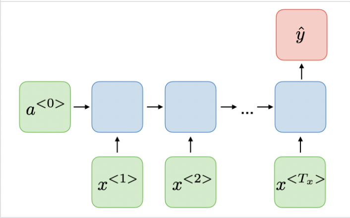
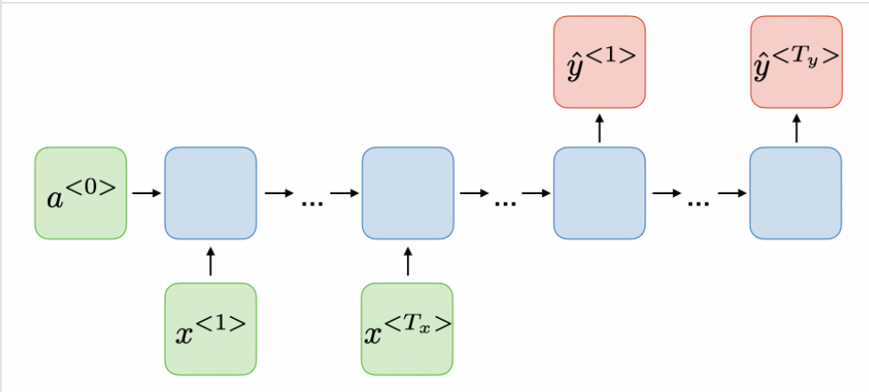

### Many To One


```bash
python text_classification.py
```

### Many To Many(Seq2Seq with Attention)


```bash
python machine_translation.py
```

### Dataset Credit
text classification: https://www.kaggle.com/team-ai/spam-text-message-classification

machine translation: https://www.manythings.org/anki/